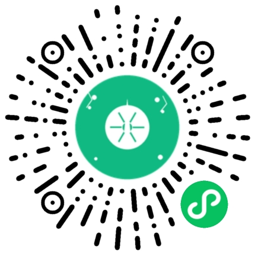

# 🏠 Fantasy House

**一个温馨实用的生活工具生态系统**

*让选择变得简单，让生活更有趣* ✨

## 🎯 这是什么？

**Fantasy House** 是一个专为解决日常生活小困扰而设计的工具集合：

- **🎡 选择困难症救星**：转盘决策、投硬币、掷骰子、抽签
- **📝 生活记录助手**：记账、理发记录、心情日记 
- **📊 数据洞察分析**：消费分析、心情趋势、决策习惯
- **💻 现代化管理**：Web 后台、API 服务、多端支持

## 🚀 立即体验

### 📱 微信小程序（推荐）

**扫码体验 Fantasy House 小程序**

## 📁 项目组成

| 项目 | 说明 |
|------|------|
| **[fantasy-house-mp](https://github.com/fantasy-house/fantasy-house-mp/)** | 📱 微信小程序 |
| **[fantasy-house-ui](https://github.com/fantasy-house/fantasy-house-ui/)** | 💻 Web 管理后台 |
| **[fantasy-house](https://github.com/fantasy-house/fantasy-house/)** | ⚡ 后端 API |

## 💡 想法反馈 & 问题报告

我们欢迎任何形式的反馈和建议！

### 🚀 提交想法
**[💡 Feature Request](https://github.com/fantasy-house/.github/issues/new?template=feature_request.md)**  
*有好想法？告诉我们！*

### 🐛 报告问题  
**[🐛 Bug Report](https://github.com/fantasy-house/.github/issues/new?template=bug_report.md)**  
*发现问题？帮我们修复！*

### 💬 交流讨论
**[💬 Discussions](https://github.com/fantasy-house/.github/discussions)**  
*想聊聊？欢迎讨论！*

### 📧 其他联系方式

- **项目维护者**：[@hb0730](https://github.com/hb0730)
- **微信**：（请通过 GitHub 联系）

## 📄 开源协议

本项目基于 [MIT License](./LICENSE) 开源协议。

## ⭐ 支持项目

如果这个项目对你有帮助，请给个 Star 支持一下！

**✨ 让选择变得简单，让生活更有趣！✨**

Made with ❤️ by [hb0730](https://github.com/hb0730)

